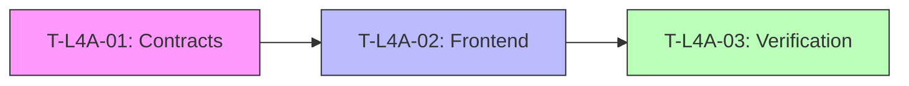

# L4-A Task Dispatch (Codex Frontend)

**Phase**: L4-A (Codex 轨)
**Goal**: Implement Dual-Window Frontend with 10D Cognition and Controlled Migration.

| Task ID | Executor | Description | Depends On | Status | Evidence |
| :--- | :--- | :--- | :--- | :--- | :--- |
| **T-L4A-01** | Kior-B | **Contracts**: Define 10D Schema & Work Item Structure | - | ⏳ Pending | - |
| **T-L4A-02** | vs--cc3 | **Frontend**: Dual Window, Adopt Button, 10D Panel | **T-L4A-01** | ⏳ Pending | - |
| **T-L4A-03** | Kior-C | **Verification**: E2E Drill (T1-T7), Report Generation | **T-L4A-02** | ⏳ Pending | - |

## Execution Flow

## Progress Tracking
- [ ] T-L4A-01 (Kior-B) Submitted
- [ ] T-L4A-02 (vs--cc3) Submitted
- [ ] T-L4A-03 (Kior-C) Submitted
- [ ] **L4-A Gate Release Decision**
