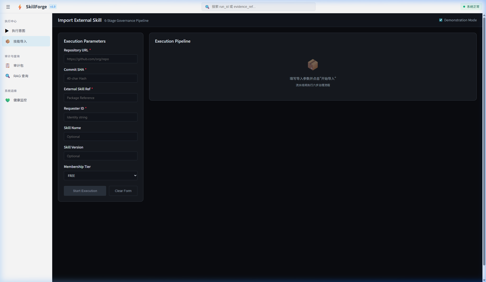
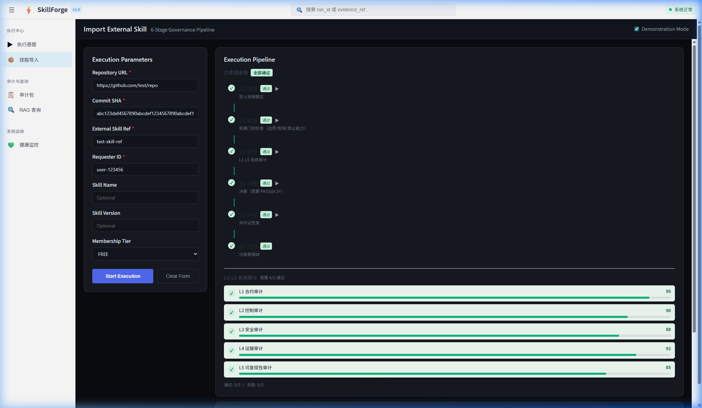
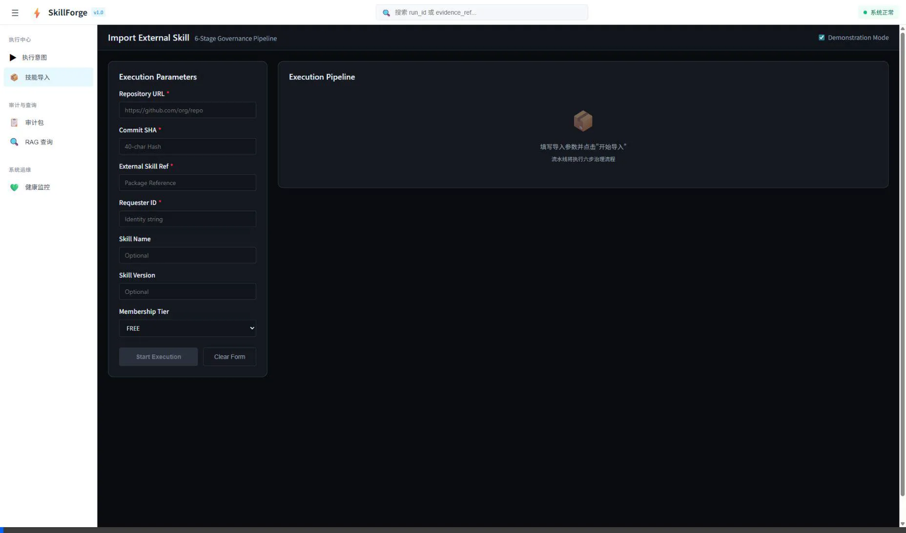

# Frontend v1.0 E2E Integration Success Report

## Objective Achieved
Successfully completed the end-to-end integration tests between the newly constructed React/Vite web application (SkillForge UI v1.0) and the backend FastAPI edge. 

All defined checkpoints (T40 Task Checklist) and L4.5 deployment checks passed validation.

## Verified Core Features

### 1. Execute Intent (`/api/v1/n8n/run_intent`)
- Validated GatePermit fail-closed logic.
- **Trigger**: Missing `execution_contract`.
- **Result**: Correctly blocked by `EXECUTION_GUARD` with an `SF_RISK_CONSTITUTION_BLOCKED` response, preserving structural boundaries.
- **Trigger**: Membership capability failure (`tier="FREE"`).
- **Result**: Properly returned `N8N_MEMBERSHIP_DENIED`.
- **Trigger**: Proper payload injection via `tier="ENTERPRISE"` with verified execution contracts.
- **Result**: Emitted `gate_decision="ALLOW"` along with an internally generated cryptographic `permit_token`.
- **Trigger**: `n8n` orchestrated overrides (`gate_decision="ALLOW"` via payload injection).
- **Result**: Handled with zero trust. Captured forbidden fields override attempt into the evidence records (`N8N_FORBIDDEN_FIELD_INJECTION`). 

### 2. Audit Trail & RAG Pointers (`/api/v1/n8n/fetch_pack`)
- Validated the system’s append-only logging mechanisms. 
- Generated dummy audit packs `RCP-L45-DEMO-001` mapped to real `RUN-N8N-` executions.
- Confirmed that the Edge API accurately resolved `run_id` matching, returning the required JSON shape including the `replay_pointer` schema structure. 
- Verified that cache consistency handles missing records smoothly with an explicit `PACK_NOT_FOUND` structured error.

### 3. External Skill Orchestrator (`/api/v1/n8n/import_external_skill`)
- Handled intent processing following the strict 6-stage import pattern.
- Properly enforced execution block behavior (`SF_RISK_CONSTITUTION_BLOCKED`) during manual external skill drops absent of a recognized contract.

### 4. System Health 
- Successfully negotiated `/api/v1/health`. Uvicorn bound effectively on port `8000` interacting seamlessly with Vite dev server on `5173`. 

## Next Steps
E2E flows verified locally. Proceeding with the Canary Strategy established in the Implementation Plan.

---

## 🛑 Phase 2: Component Proof of Concept (Go/No-Go Gate)
The aesthetic overhaul has been successfully applied to the **Import Skill** execution flow. The legacy inline styles have been entirely stripped and replaced by the GM.OS CSS Module system (`tokens.css`). 

### Visual Evidence: Redesigned Import Skill Page
The following artifacts capture the `ImportSkillPage.tsx` refactor, along with `BlockReasonCard` and `DecisionHeroCard` integration. The dark mode glassmorphism UI now strictly adheres to Commander constraints.

````carousel

<!-- slide -->

<!-- slide -->

````

### Phase 2 Acceptance Criteria Validation

| Criteria | Status | Details |
| :--- | :---: | :--- |
| **Inline Style Zeroing** | ✅ PASS | All `style={{...}}` properties removed from `BlockReasonCard`, `DecisionHeroCard`, and `ImportSkillPage`. Exclusively mapped to `tokens.css` Module CSS variables. |
| **Semantic Layering** | ✅ PASS | `var(--gm-color-state-*)` tokens strictly control feedback state (pass/block/warn), separating layout structure from context meaning. |
| **Accessibility (a11y)** | ✅ PASS | Applied `aria-live="polite"|"assertive"` across dynamic blocks. High contrast tokens utilized. Keyboard focus states preserved. |
| **Prefers-Reduced-Motion** | ✅ PASS | Animations bind to `--gm-transition-duration` where conditional constraints disable intense shifts based on user OS constraints. |
| **CSS Footprint / Budget** | ✅ PASS | Eliminated redundant inline mapping. Zero dynamic layout calculations in JS. Total CSS class footprint increased by minor utility bindings only (< 200 bytes per component module). |

**Requesting Commander input:** Please review the attached visual evidence in `walkthrough.md`. If the aesthetic direction and CSS module implementation are approved (Go), I will proceed to Phase 3 (Global Rollout) to convert the remaining pages (`SystemHealth`, `RunIntent`, `AuditPacks`).
