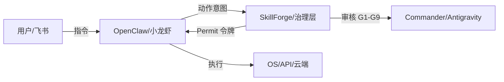

# OpenClaw + SkillForge Integration Plan

## Goal
Integrate the **OpenClaw (小龙虾)** agent framework with the **SkillForge** governance system. This will transform OpenClaw from an autonomous agent into a "Governed Legion," where every sensitive action is validated, audited, and permitted by the SkillForge Brain.

## User Review Required
> [!IMPORTANT]
> **Integration Depth Choice**: I propose focusing on **Level 3 (Active Governance)**. This is the most complex but provides the highest value for GM.OS.
> *   **Passive**: Just logs OpenClaw actions to SkillForge.
> *   **Sandbox**: Uses OpenClaw as the G6 test environment.
> *   **Active Proxy**: Every "Action" by OpenClaw (file write, API call) triggers a SkillForge G9 Permit check.
> *   **Interface Extension**: Support **Feishu (Lark)** integration for end-user interaction.

## Architecture: The Governance Chain

## Proposed Changes

### [Component] OpenClaw (WSL2/Docker)
#### [NEW] `openclaw-skillforge-adapter`
*   A custom middleware/skill for OpenClaw that intercepts actions.
*   Maps OpenClaw action requests to SkillForge `requested_action` formats.

### [Component] SkillForge Backend (Python)
#### [MODIFY] [registry_store.py](file:///d:/GM-SkillForge/skillforge/src/storage/registry_store.py)
*   Add support for `OPENCLAW` source type in skill registration.

#### [NEW] `openclaw_runtime_adapter.py`
*   Translates OpenClaw trace events into SkillForge `AuditPack` evidence.
*   Connects to G6 (Sandbox) for automated verification of OpenClaw agent policies.

#### [NEW] `Governance-Link-Protocol`
*   Define a standard for "Interruption & Resumption": How OpenClaw waits for SkillForge's Feishu-based or UI-based approval.

### [Interface] Feishu (Lark)
*   **Mode**: WebSocket (Long Connection) for easier setup in home-lab/WSL2.
*   **Events**: Message events synced to SkillForge's Audit Log.

## Verification Plan

### Automated Tests
1.  **Direct G5 -> G6 -> G9 Chain**:
    *   Simulate an OpenClaw action request via a mock Feishu event.
    *   Run `gate_permit.py` checks.
    *   Verify `ALLOW/BLOCK` decision correctly reflects in the dummy OpenClaw log.

### Manual Verification
1.  **"Halt the Hydra" Test**:
    *   Start OpenClaw + Feishu.
    *   Send command via Feishu: "Delete important_file.txt".
    *   SkillForge (Windows) interecepts. User sees the block reason in SkillForge UI.
    *   Verify Feishu displays "Permission Denied by SkillForge" or similar.

